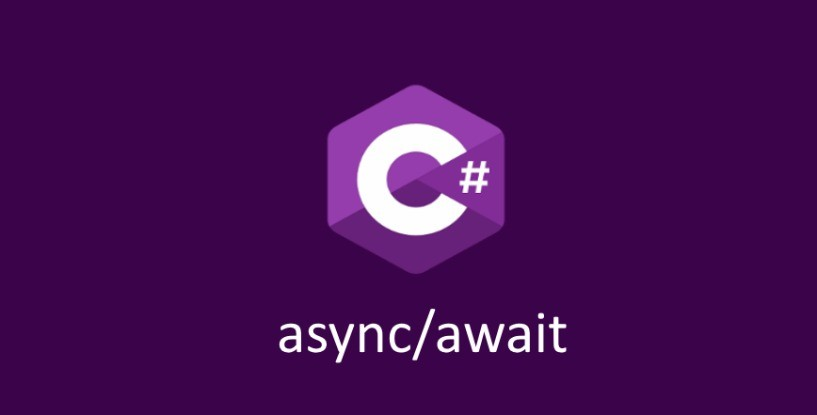

# TaskLike



## Intro

This mini project is an example of creating a custom `Task<T>` like type, by implementing an Awaiter, and a AsyncMethodBuilder for a custom task-like type.  
We create a `Task` type that catches, and logs all errors coming from a `async` function.  

For more info see:  
* [AsyncMethodBuilder](https://learn.microsoft.com/en-us/dotnet/csharp/language-reference/proposals/csharp-10.0/async-method-builders)
* [TaskAwaiter](https://learn.microsoft.com/en-us/dotnet/api/system.threading.tasks.task.getawaiter)
* [IValueTaskSource](https://learn.microsoft.com/en-us/dotnet/api/system.threading.tasks.sources.ivaluetasksource-1)

## Show me the code!

```cs
public async ValueTask Play() // ValueTaskAwaiter
{
    // Happy path.
    Response<int> response = await Sandbox(); // Custom Awaiter
    // Response is 1 after the await
}

private static async ResponseAsync<int> Sandbox() // Custom AsyncMethodBuilder
{
    await Task.Yield(); // YieldAwaiter
    return await Task.Delay(1).ContinueWith(_ => 1); // TaskAwaiter
}
```

As you can see we have mixed many different sorts of awaiters in here, and they all work together.  
The custom task-like type `ResponseAsync<T>` will create a `Maybe`, or `Option`, or `Result` (*whatever you want to call it*) around the `T` response (*what I call it*) after the `await`.  
This means you will never get a runtime exception from an `async` method, when using the type `ResponseAsync<T>`.  

For example this is fine now:
```cs
public async ValueTask Play()
{
    // Error handling.
    Response<int> err01 = await ThrowError01();
    Response<int> err02 = await ThrowError02();

    int result = err01 && err02 ? err01 + err02 : -1;
    // result is "-1" here, as both responses failed.
}

private static async ResponseAsync<int> ThrowError01() => throw new Exception("Error with no await!!!");
private static async ResponseAsync<int> ThrowError02() { await Task.CompletedTask; throw new Exception("Error WITH await."); }
```

All errors are sent to your own logging system, which is configured at startup.  
You can also convert `ResponseAsync<T>` into `Task<Response<T>>`, so you can use `Task's` native functions, such as  `WhenAll()`:

```cs
        public async ValueTask Play()
        {
            // Many tasks at once.
            Response<int>[] results = await Task.WhenAll(Sandbox().AsTask(), Sandbox()); // Both explicit, and implicit task conversions exist.
            var sum = results.Where(x => x).Sum(x => x);
            // sum is "2" here, as both functions ran; and returned 1 each.
        }

        private static async ResponseAsync<int> Sandbox()
        {
            await Task.Yield();
            return await Task.Delay(1).ContinueWith(_ => 1);
        }
```

## Remarks

This project demonstrates some interesting `Task` types we are able to create in `C#`.  
While `ResponseAsync<T>` only cares about handling exceptions (_and removing null return values_), you could make many different types.  
For example you could time the duration between each `await` call for some audit logging.  
You could modify thread settings before / after each `await` in a function (*i.e. setting the culture, or user, or cache, etc*).  
With the custom awaiters you can convert the type on the right of the `await` into whatever type you like on the left.  
For example you could `Trim` all strings, and set them to uppercase (*idk why you would, but you could!*).  
